# Radio Calico System Architecture

This document provides visual architecture diagrams for the Radio Calico streaming platform.

## Production Architecture (3-Container Setup)

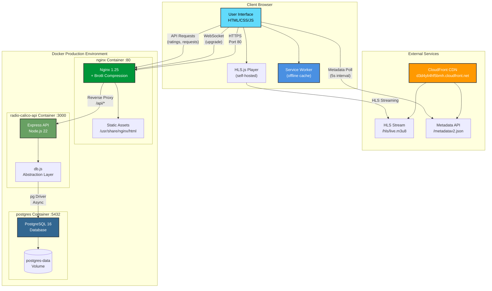

### Production Components

**Nginx Container (Port 80 - Public)**
- Serves optimized static assets from `dist/` (Vite build output)
- Brotli + gzip compression (15-20% better compression)
- Reverse proxies `/api/*` to Node.js API
- Security headers (CSP, X-Frame-Options, HSTS)
- 1-year caching for hashed assets

**API Container (Port 3000 - Internal)**
- Express.js REST API
- db.js abstraction layer (auto-converts SQLite → PostgreSQL)
- Rate limiting (100 req/15min general, 10 req/min ratings)
- Input validation (express-validator)
- Security headers (helmet.js)

**PostgreSQL Container (Port 5432 - Internal)**
- PostgreSQL 16 Alpine
- Named volume for persistence
- Health checks every 10s
- Database: `radio`, User: `radio`

**External Services**
- CloudFront CDN: HLS stream + metadata
- Google Fonts: Montserrat + Open Sans (async loaded)

## Development Architecture (1-Container Setup)

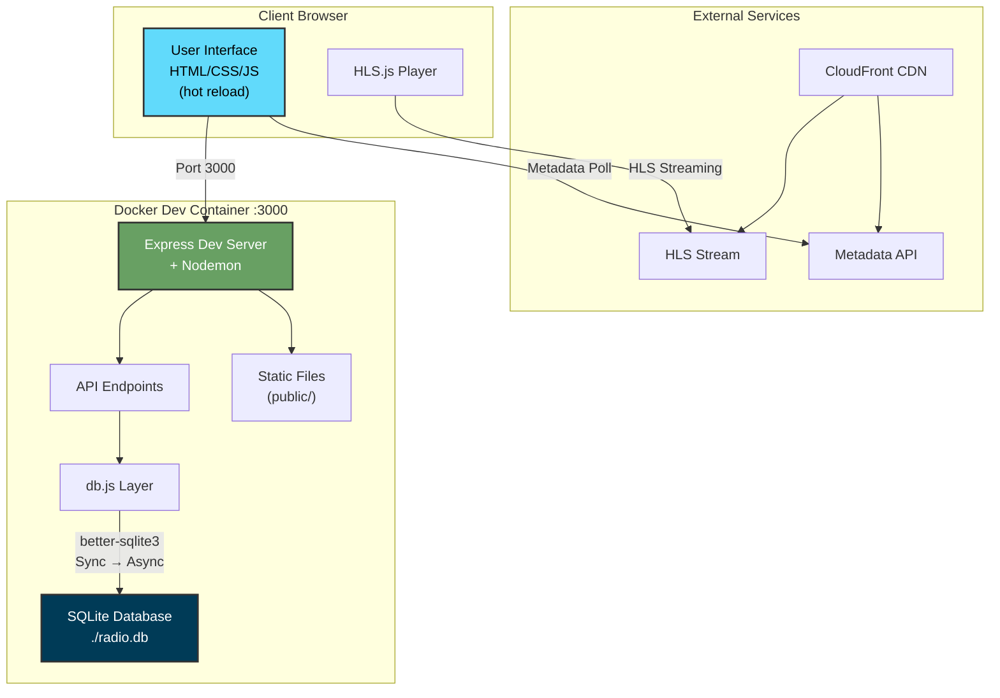

### Development Features
- Single container (node:22-alpine)
- SQLite database (file: `./radio.db`)
- Volume mount for hot-reload
- Nodemon auto-restart on `server.js` changes
- Express serves both API and static files

## Database Schema

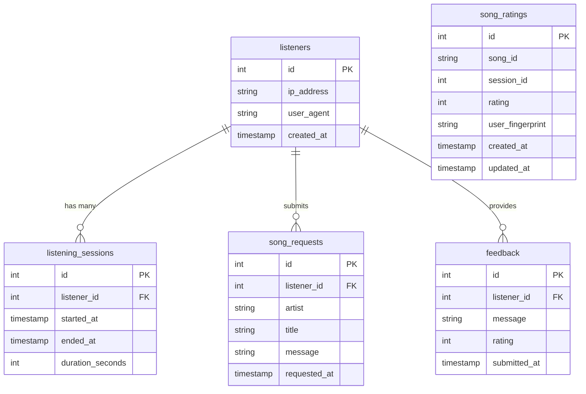

### Schema Notes
- **song_ratings**: Unique index on `(song_id, user_fingerprint)` prevents duplicate votes
- **user_fingerprint**: SHA-256 hash (IP + User-Agent + Accept-Language + Accept-Encoding)
- **SQLite → PostgreSQL differences**: Auto-handled by db.js abstraction layer

## Data Flow Diagrams

### Song Rating Flow

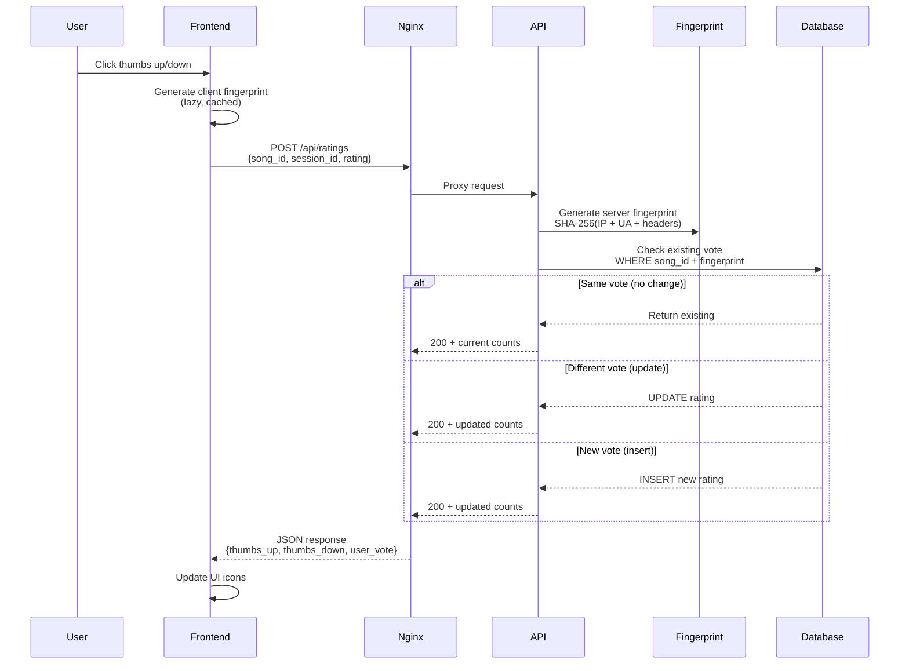

### Metadata Update Flow

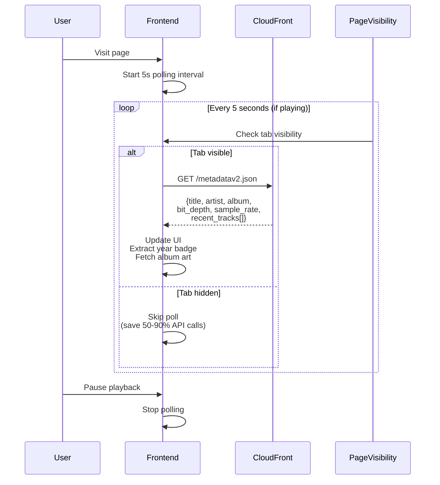

### HLS Streaming Flow

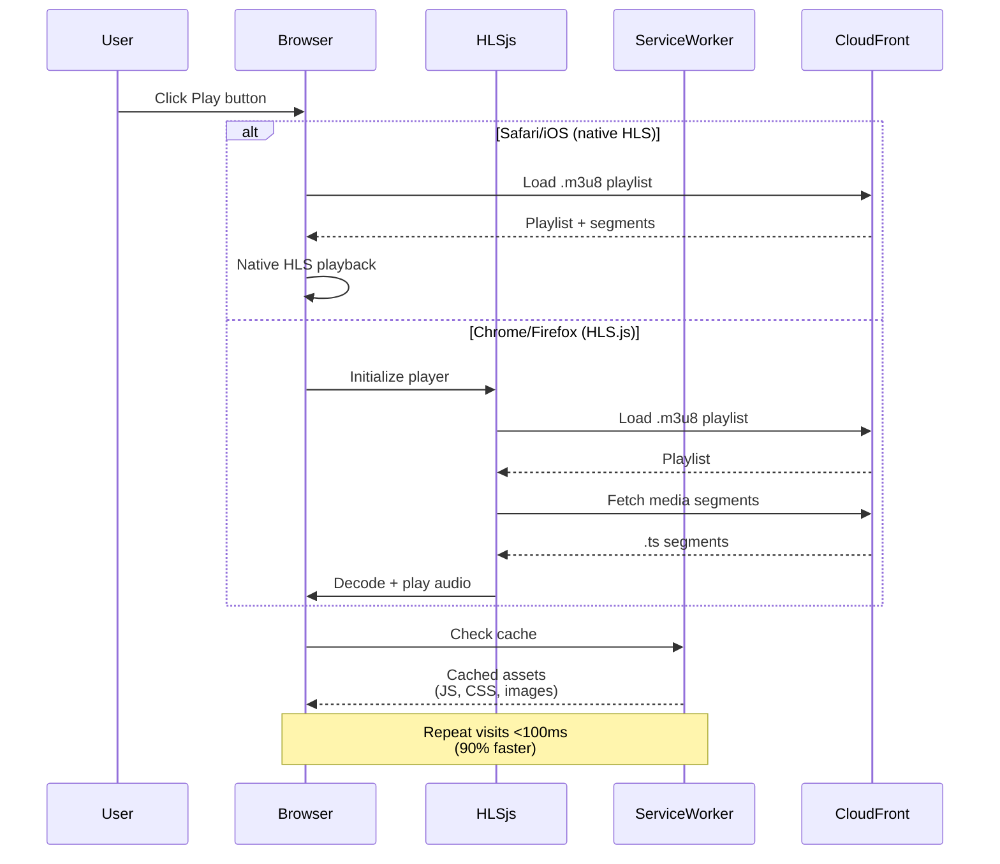

## Performance Optimization Architecture

### Build Pipeline

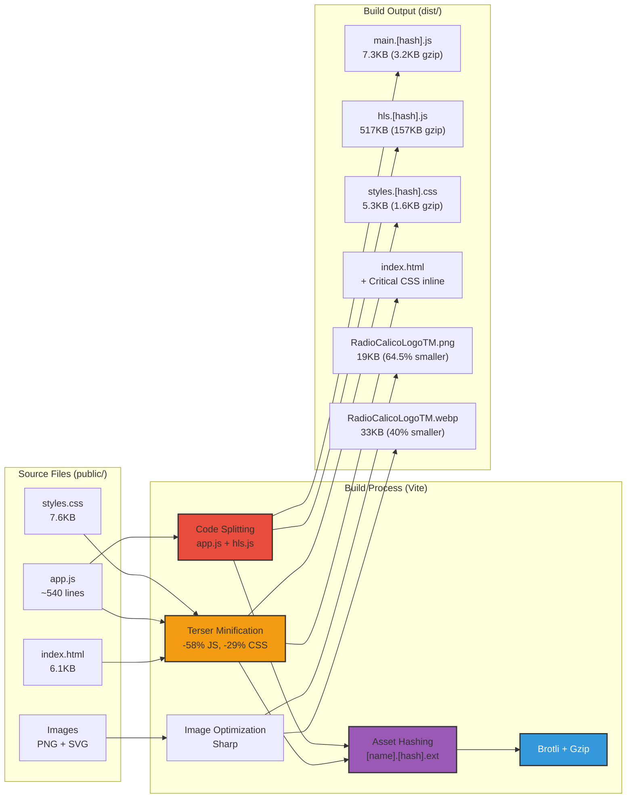

### Resource Loading Strategy

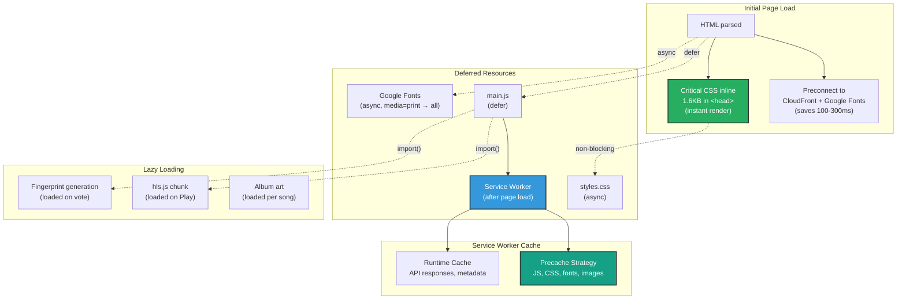

## Security Architecture

### Request Security Pipeline

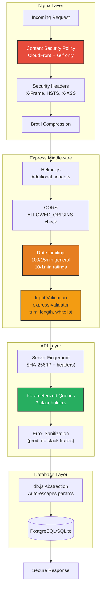

### Deduplication Strategy (Song Ratings)

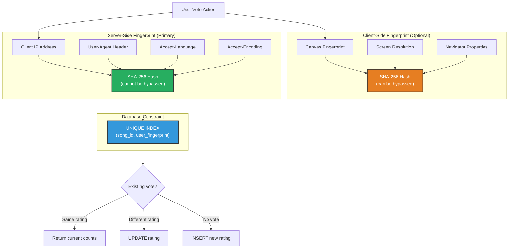

## Deployment Comparison

| Aspect | Development | Production |
|--------|-------------|------------|
| **Containers** | 1 (radio-calico-dev) | 3 (nginx, API, postgres) |
| **Database** | SQLite (./radio.db) | PostgreSQL (volume) |
| **Static Files** | Express (public/) | Nginx (dist/) |
| **Build** | Source files | Vite optimized |
| **Port** | 3000 | 80 (nginx only) |
| **Hot Reload** | Yes (nodemon + mount) | No (immutable) |
| **Compression** | None | Brotli + gzip |
| **Image Size** | ~350MB | ~150MB (API) + 40MB (nginx) |
| **Security** | Basic | Full (CSP, rate limit, headers) |
| **Performance** | Good | Optimized (95-100 Lighthouse) |

## Technology Stack Overview

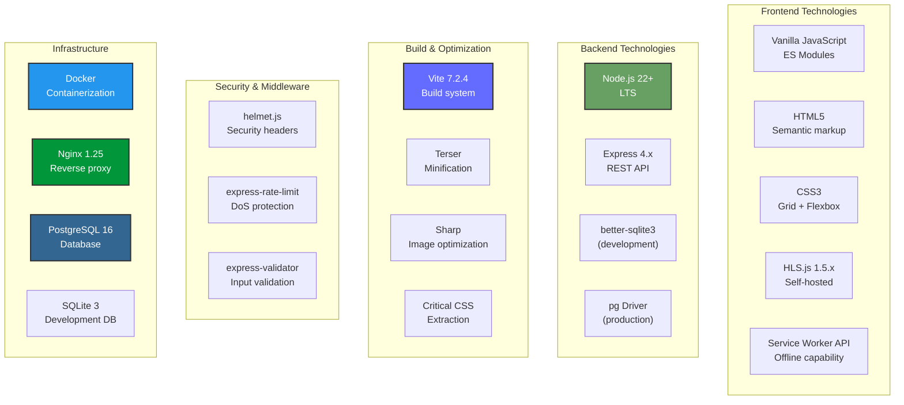

## External Dependencies

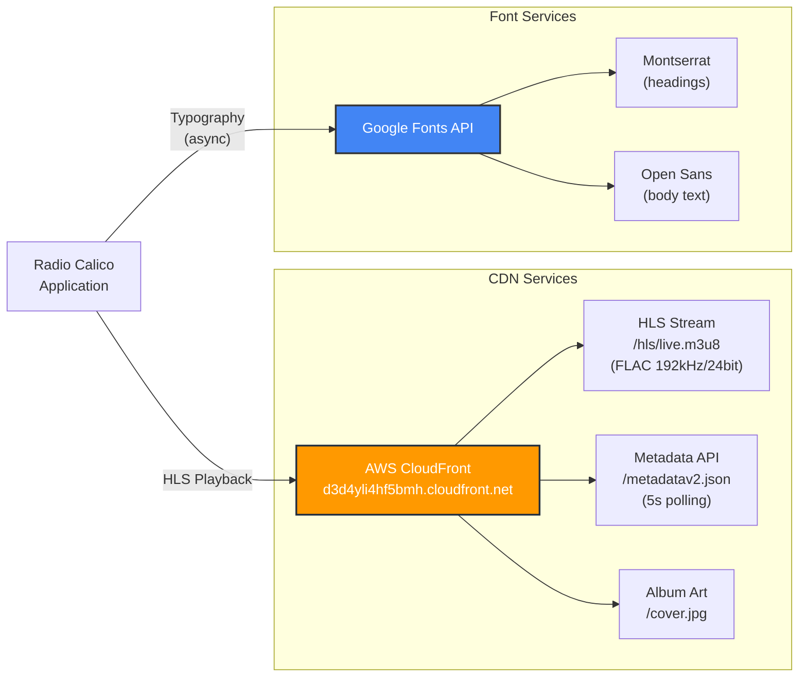

## Performance Metrics

### Load Time Progression

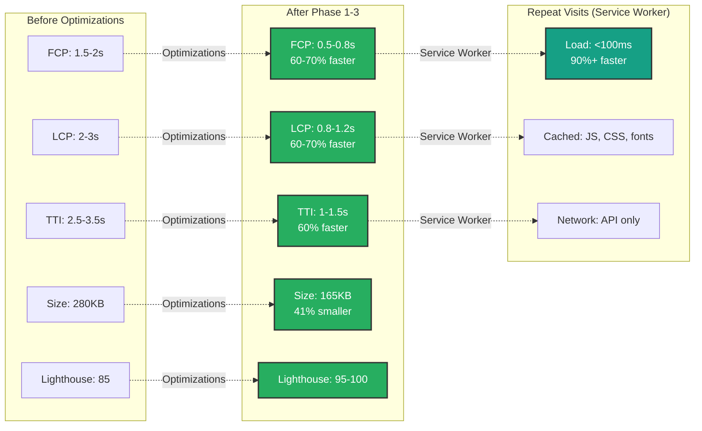

---

**Last Updated:** 2025-12-01
**Version:** 1.0
**Maintained By:** Radio Calico Development Team
